# FLOWS — GuidanceConnect Django Replica (24 flows)

Port of the original Next.js system behavior. Use with `PLAN.md` phases.  
Mermaid flowcharts — implement every branch and error path.

---

## 1. Route guards (replaces `proxy.ts` + page `requireAdmin` / role checks)

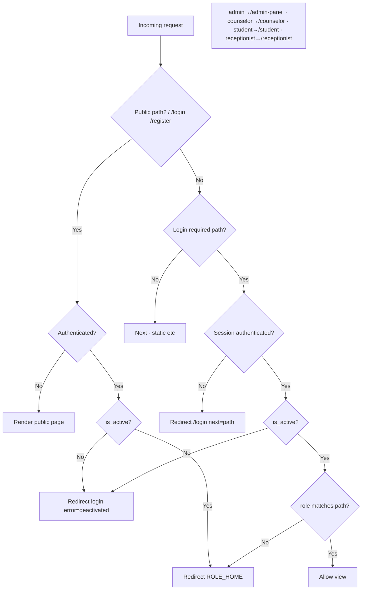

**Django implementation:** `@login_required` + `role_required(*roles)` decorator on every view; inactive → logout + redirect. Admin pages also use a `requireAdmin`-equivalent helper.

---

## 2. Student registration

```mermaid
flowchart TD
    A[/register form] --> B[Zod-parity validation<br/>email password≥8 name student_id department]
    B -->|Fail| C[Field errors]
    C --> A
    B -->|Pass| D[Create User]
    D --> E[post_save → Profile role=student<br/>is_active=True user_no assigned]
    E --> F[Audit signal optional]
    F --> G[Auto login optional / redirect /login]
    G --> H[Login → ROLE_HOME /student]
    D -->|username/email exists| I[Error: already registered]
```

---

## 3. Sign-in

```mermary
flowchart TD
    A[Login form] --> B{Valid credentials?}
    B -->|No| C[Invalid email or password]
    B -->|Yes| D{Profile exists + valid role?}
    D -->|No| E[error=no_profile]
    D -->|Yes| F{is_active?}
    F -->|False| G[Logout + error=deactivated]
    F -->|True| H[Redirect ROLE_HOME]
```

---

## 4. Sign-out

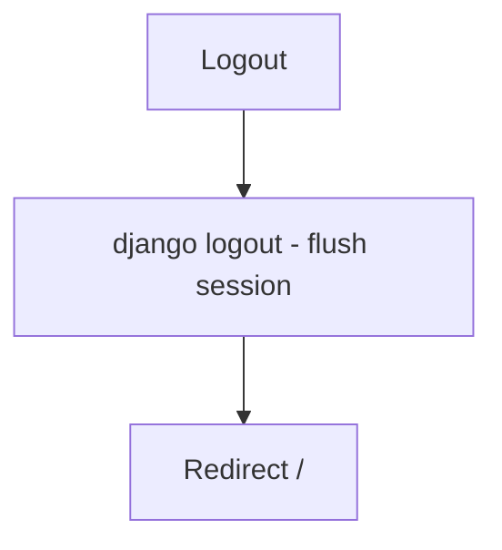

---

## 5. Password change

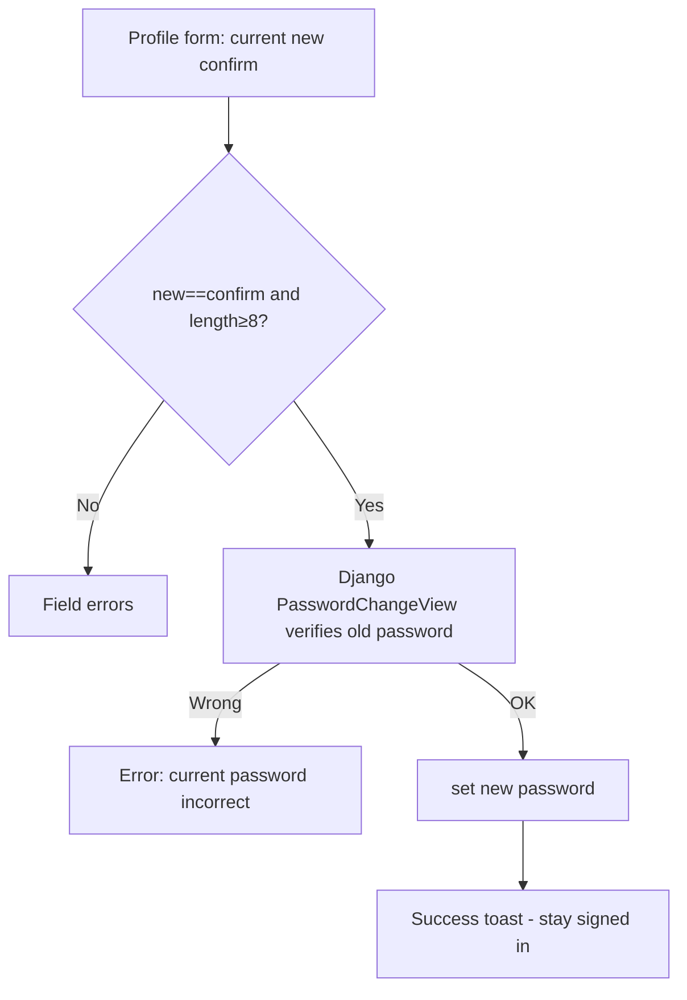

---

## 6. Role home redirect after login

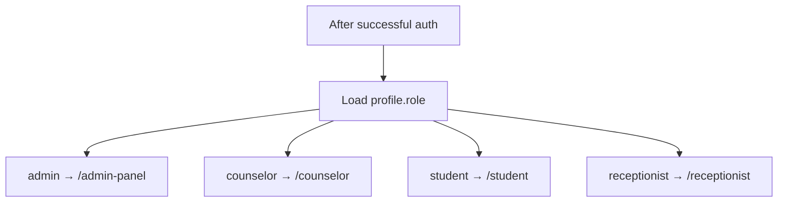

---

## 7. Student: available slots

```mermaid
flowchart TD
    A[Pick counselor + date + TZ] --> B{Valid uuid date TZ?}
    B -->|No| C[Invalid inputs]
    B -->|Yes| D{Signed in as active student?}
    D -->|No| E[Only active students]
    D -->|Yes| F[Day bounds in TZ]
    F --> G[Booked = appointments counselor in day status pending|confirmed]
    G --> H[Generate hourly slots 09:00-16:00]
    H --> I[Subtract taken minutes]
    I --> J[Return free ISO slots]
```

**Django:** `core/services/slots.py` — port `lib/appointment-slots.ts`.

---

## 8. Student: book appointment

```mermaid
flowchart TD
    A[Appointments form] --> B{Valid body?<br/>counselor uuid scheduled concern notes≤2000}
    B -->|No| C[Invalid booking details]
    B -->|Yes| D{Future datetime?}
    D -->|No| E[Choose future date and time]
    D -->|Yes| F{Active student?}
    F -->|No| G[Only active students can book]
    F -->|Yes| H{Counselor exists role=counselor?}
    H -->|No| I[That counselor is not available]
    H -->|Yes| J{Clash: same counselor same minute pending|confirmed?}
    J -->|Yes| K[That time was just taken]
    J -->|No| L[INSERT status=pending]
    L -->|DB error| M[Could not save appointment]
    L -->|OK| N[log_action APPOINTMENT_CREATED]
    N --> O[Redirect /appointments success]
```

---

## 9. Student: cancel appointment

```mermaid
flowchart TD
    A[Cancel click] --> B{Own appointment?}
    B -->|No| C[Not found - RLS/scoping]
    B -->|Yes| D{status in cancelled|completed?}
    D -->|Yes| E[Can no longer be cancelled]
    D -->|No| F[UPDATE status=cancelled]
    F --> G[log_action APPOINTMENT_CANCELLED_STUDENT]
    G --> H[Success]
```

---

## 10. Counselor: status update (state machine)

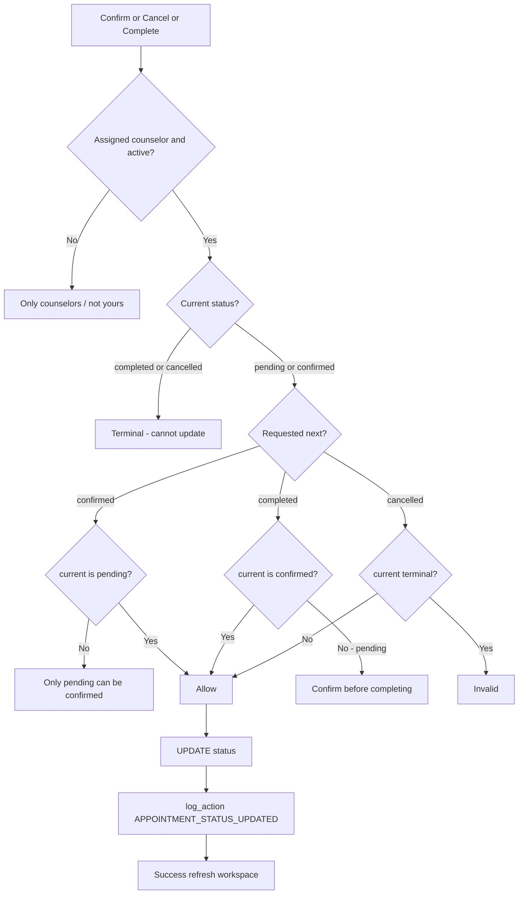

**Allowed transitions only:** pending→confirmed/cancelled; confirmed→completed/cancelled; completed/cancelled = terminal.

---

## 11. Case note save (encrypt + upsert)

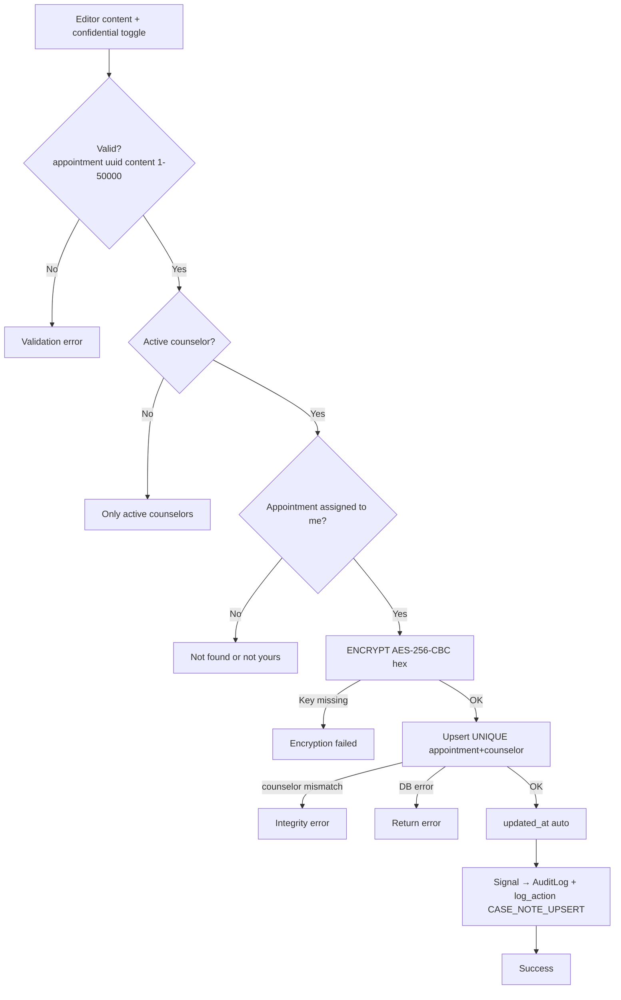

---

## 12. Case note read / decrypt

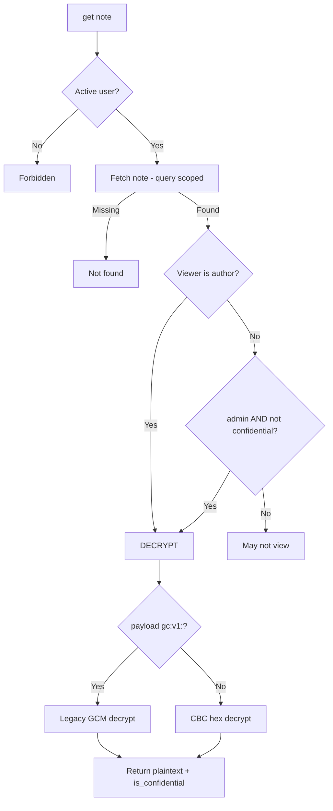

**Student visibility:** only `is_confidential=False` rows appear in student queries.

---

## 13. Student mood check-in

```mermaid
flowchart TD
    A[Mood widget good|okay|low + note≤500] --> B{Valid?}
    B -->|No| C[Invalid check-in]
    B -->|Yes| D{Active student?}
    D -->|No| E[Only active students]
    D -->|Yes| F{mood == low?}
    F -->|No good/okay| G[log_action STUDENT_MOOD_CHECKIN] --> H[ok notified=false]
    F -->|Yes| I[Latest appointment status != cancelled]
    I -->|None| J[Error: book a session first or front desk]
    I -->|Found| K{Counselor profile still counselor?}
    K -->|No| L[Counselor no longer available]
    K -->|Yes| M[INSERT StudentMoodAlert]
    M -->|Need existing pair - scoping| N[Error if no appointment pair]
    M -->|OK| O[log_action STUDENT_MOOD_ALERT]
    O --> P[ok notified=true counselorName]
    P --> Q[Counselor workspace feed shows alert]
```

---

## 14. Chat: restore session

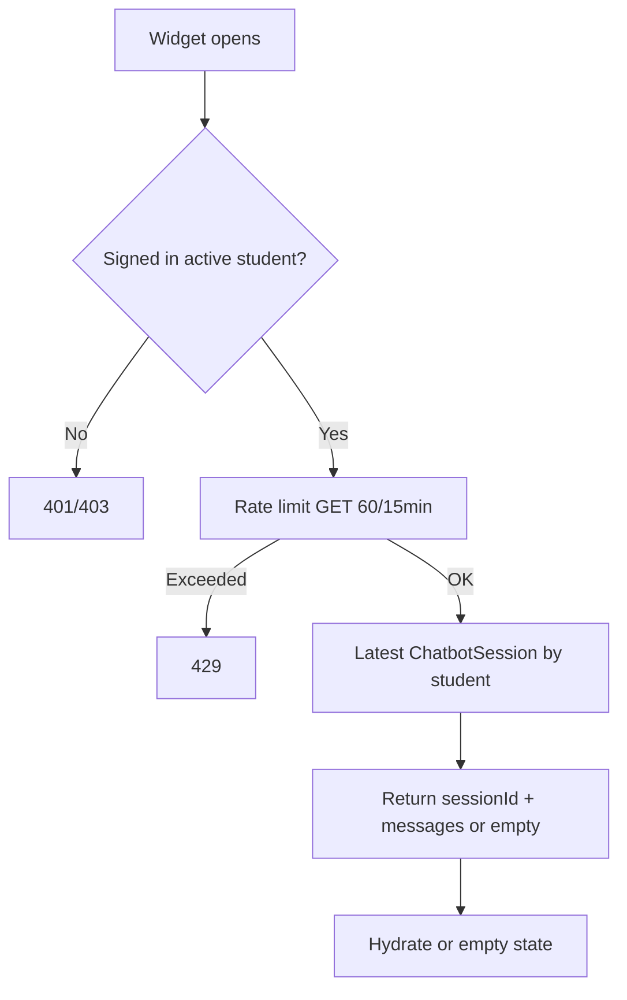

---

## 15. Chat: send message (stream + persist)

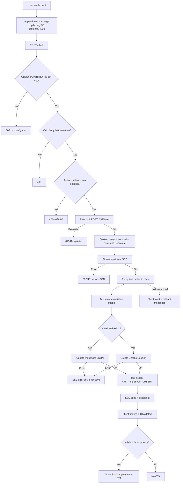

**Rate limits:** POST 24/15 min · GET session 60/15 min · history max 36 · content ≤ 24000.

**CTA patterns (port `lib/chat/cta.ts`):** talk to counselor, book appointment, struggling, suicide, self-harm, crisis, etc.

---

## 16. Receptionist: 4-step booking

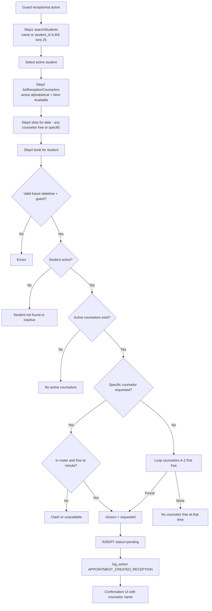

---

## 17. Admin: change user role

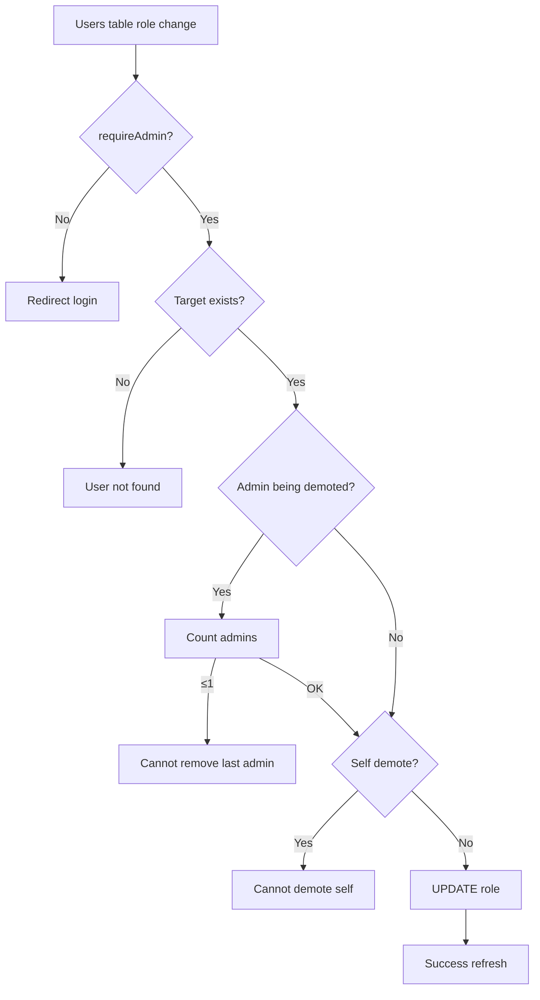

---

## 18. Admin: activate / deactivate user

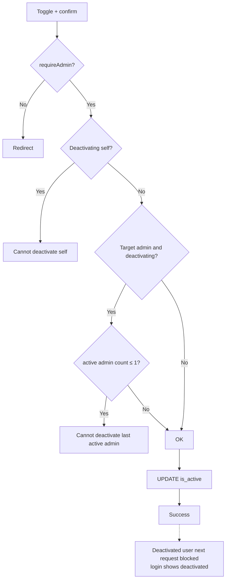

---

## 19. Admin: dashboard metrics

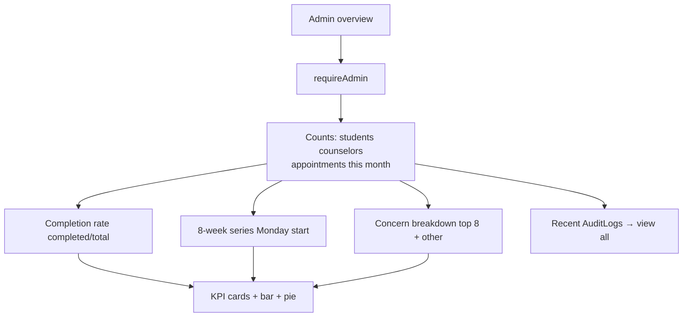

**Port:** `lib/admin-metrics.ts` → `core/services/metrics.py`.

---

## 20. Admin: reports + export

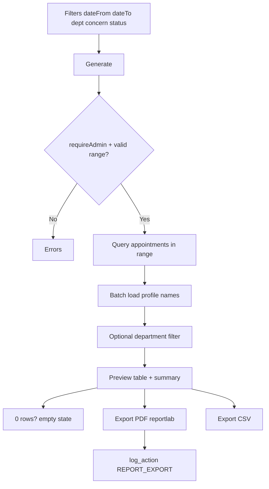

---

## 21. Admin: audit log viewer

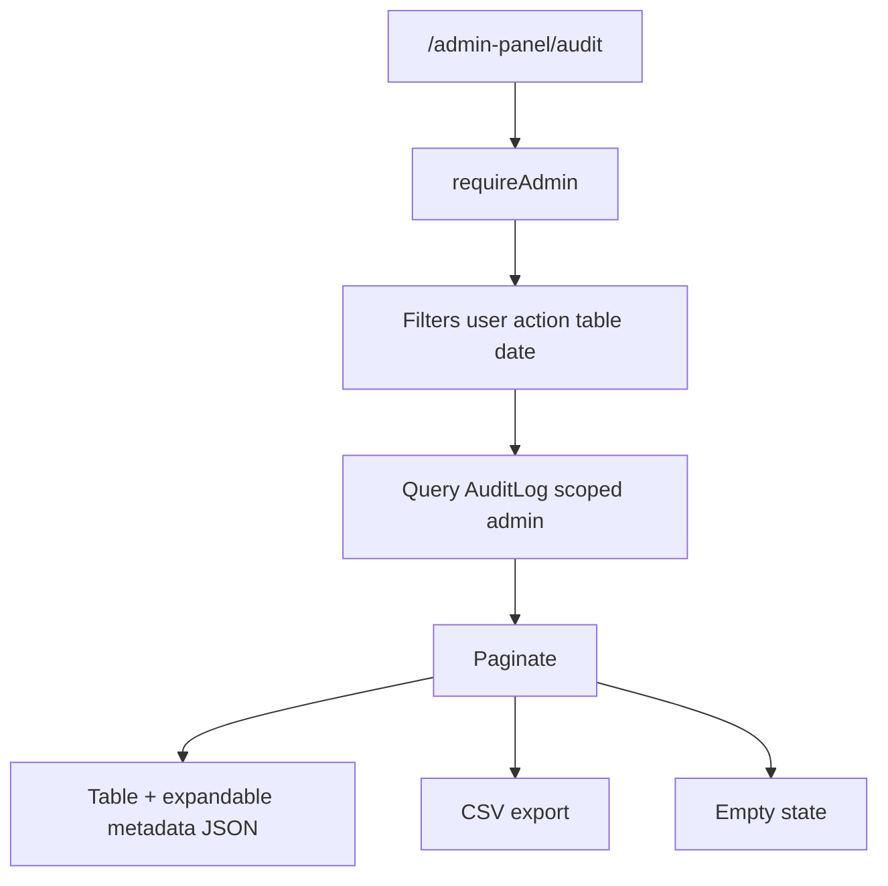

---

## 22. Student dashboard load

```mermaid
flowchart TD
    A[GET /student] --> B{role student active?}
    B -->|No| C[Redirect guard]
    B -->|Yes| D[Profile greeting]
    D --> E[Upcoming appointments]
    D --> F[History past/cancelled]
    D --> G[Non-confidential case history]
    D --> H[Mood widget]
    D --> I[Chat widget hydrate]
    E & F & G --> J[Render dashboard]
```

---

## 23. Counselor workspace load

```mermaid
flowchart TD
    A[GET /counselor] --> B{role counselor active?}
    B -->|No| C[Redirect]
    B -->|Yes| D[Stat chips today upcoming past]
    D --> E[Mood alerts feed counselor=me]
    D --> F[Today sessions + status actions]
    D --> G[Upcoming and Past tables]
    E & F & G --> H[Render workspace]
    F -->|actions| I[Flow 10 status machine]
    F -->|open note| J[Flow 11-12 case note]
```

---

## 24. Audit dual-writer (app + signal)

```mermaid
flowchart LR
    subgraph Explicit service calls
        A1[APPOINTMENT_*]
        A2[CASE_NOTE_UPSERT]
        A3[STUDENT_MOOD_*]
        A4[CHAT_SESSION_UPSERT]
        A5[REPORT_EXPORT]
    end
    subgraph Signals
        S1[Profile post_save/post_delete]
        S2[CaseNote post_save/post_delete]
    end
    A1 & A2 & A3 & A4 & A5 & S1 & S2 --> L[log_action never raises]
    L --> M[AuditLog insert user action table record_id metadata]
```

**Port:** `lib/audit.ts` — swallow all errors; invalid UUID `record_id` → null; missing user → skip.

---

## Implementation mapping

| Flow # | Phase | Primary Django modules |
|---|---|---|
| 1, 6 | 3 | `core/guards.py`, middleware |
| 2–5 | 3 | auth views/forms |
| 7–10 | 4 | `services/slots.py`, `services/appointments.py`, views |
| 11–12 | 5 | `services/encryption.py`, `services/case_notes.py` |
| 13 | 6 | `services/mood.py` |
| 14–15 | 6 | `services/chat.py`, chat views + JS |
| 16 | 4 | `services/receptionist.py`, receptionist views |
| 17–21 | 8 | admin views + `services/reports.py`, `metrics.py`, `audit.py` |
| 22–23 | 7 | page views + templates |
| 24 | 8 | `services/audit.py` + signals |
